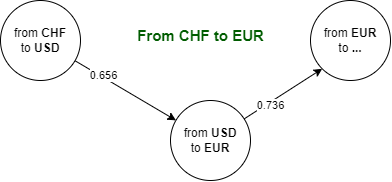

# GnbTransactionsService

GnbTransactionsService es una API diseñada siguiendo **arquitectura en capas**, lo que permite separar responsabilidades y facilita el mantenimiento y la escalabilidad.

--------------

## Arquitectura en Capas

La aplicación se organiza en cuatro capas principales:

### 1. Controllers (API)
- Punto de entrada de la aplicación.
- Reciben solicitudes del cliente, mapean DTOs a modelos de dominio y delegan la lógica a los servicios.

**Endpoints:**
- `RatesController` : consultas de tasas de cambio.
- `SkusController` : operaciones relacionadas con SKUs.
- `TransactionsController` : procesamiento de transacciones.

### 2. Application
- Contiene la lógica de negocio y coordina los servicios para cumplir los casos de uso.
- Interactúa con la capa de infraestructura para acceder a datos.

**Servicios principales:**
- `RateService` : obtiene y procesa tasas de cambio.
- `CurrencyConverterService` : realiza conversiones entre monedas (cacheable).
La lógica de conversión de divisas modela los tipos de cambio como un grafo ponderado dirigido y utiliza la búsqueda en anchura (BFS) para encontrar una ruta de conversión válida, al tiempo que acumula el tipo de cambio de forma multiplicativa.


- `TransactionService` : gestiona creación y consulta de transacciones.

### 3. Infrastructure
- Gestiona persistencia de datos y middleware.
- Implementa repositorios y aplica **inyección de dependencias (DI)**.

**Componentes:**
- `RateRepository` : implementa `IRateRepository`.
- `TransactionRepository` : implementa `ITransactionRepository`.
- `ErrorHandlingMiddleware` : manejo global de errores.

### 4. Domain
- Contiene los modelos de negocio y excepciones específicas.
- Independiente de frameworks o detalles de infraestructura.

**Elementos clave:**
- **Modelos:** `Transaction`, `Rate`.
- **Excepciones:** `CurrencyConversionException`, `DataConsistencyException`.

**Beneficios de esta arquitectura:**
- Separación clara de responsabilidades  
- Alta mantenibilidad  
- Escalabilidad para nuevas funcionalidades  


---

## Descripción de la API

**Tecnología:**
- .NET 8
- Uso de `decimal` para importes y tasas (no `double`)

**Reglas de negocio:**
- Redondeo solo al total final usando:  `Math.Round(total, 2, MidpointRounding.ToEven)`
- Los importes negativos se incluyen en el cálculo del total (restan al total).

**Casos especiales:**
- SKU sin transacciones: `GET /api/skus/{sku}` devuelve 404 con un mensaje explicativo.
- Transacción sin camino a EUR: se excluye del total y se registra una advertencia. Si todas se excluyen, el resultado es tratado como SKU no existente (404).
- Datos inconsistentes: al cargar JSON se validan campos básicos; errores de consistencia lanzan `DataConsistencyException` y se traducen a 400 Bad Request por el middleware.
- Logging y manejo de errores centralizados en `ErrorHandlingMiddleware` (excepciones conocidas se traducen a códigos HTTP adecuados, sin volcar stacktrace al cliente).
- Inyección de dependencias:
	- Repositorios registrados por interfaz: `ITransactionRepository`, `IRateRepository`.
	- `RateService` construye el `CurrencyConverter` a partir de las tasas y se registra en DI para compartir la instancia.
- Redondeo:
  - Se aplica redondeo sólo al total final: `Math.Round(total, 2, MidpointRounding.ToEven)` ("Banker's Rounding").
  - Razonamiento: evitar acumulación de errores por redondear cada línea y mantener coherencia contable en totales.

## Como ejecutar
**Local:**
dotnet restore
dotnet run --project GnbTransactionsService

Acceder a Swagger: https://localhost:7178/swagger & http://localhost:5177/swagger

**Dcoker:**
Posicionarse en la raíz del proyecto GnbTransactionsService (donde está el `Dockerfile`) y ejecutar los siguientes comandos:

# Construir imagen
`docker build -t gnb-transactions-service .`

# Ejecutar contenedor
`docker run -p 5000:8080 -e ASPNETCORE_URLS=http://+:8080 -e DOTNET_RUNNING_IN_CONTAINER=true -e ASPNETCORE_ENVIRONMENT=Development gnb-transactions-service`

API disponible en: http://localhost:5000
Swagger: http://localhost:5000/swagger (Development)

## Tests
Proyecto de tests: GnbTransactionService.Tests

Incluye:
- CurrencyConverterTests : conversión directa, multi-salto, cache y redondeo.
- TransactionServiceTests : SKU inexistente, exclusión de transacciones no convertibles, importes negativos.
- DtoMappingTests : mapeo básico modelo DTO.

# Ejecutar tests:
`dotnet test`

Ejecutar únicamente el proyecto de tests `GnbTransactionService.Tests`:

```
 dotnet test ./GnbTransactionService.Tests/GnbTransactionService.Tests.csproj
```