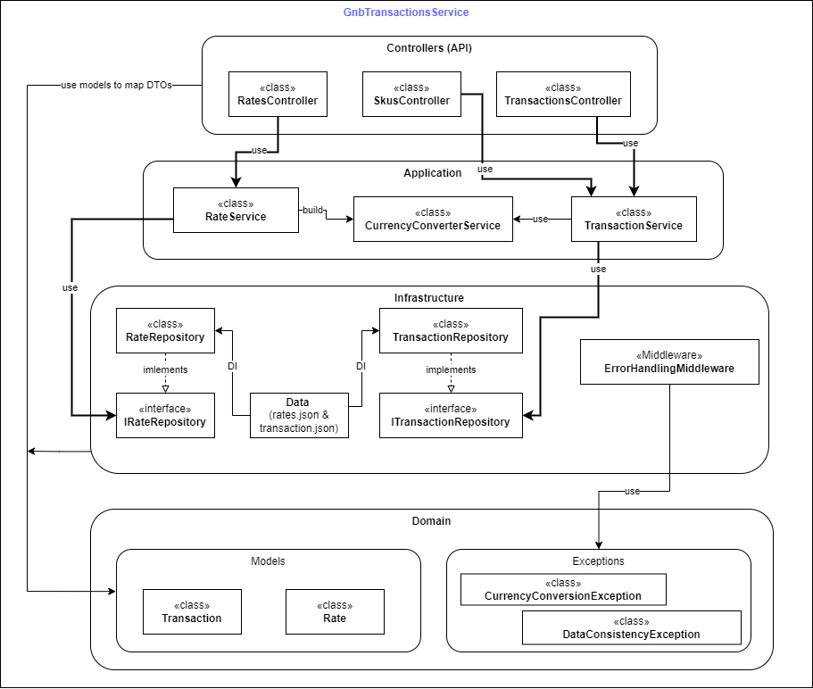

# GnbTransactionsService

Arquitectura en Capas de GnbTransactionsService

La aplicación GnbTransactionsService está diseñada siguiendo una arquitectura en capas, lo que permite separar responsabilidades y facilitar el mantenimiento y la escalabilidad. La estructura se organiza de la siguiente manera:

1. Controllers (API)

Los Controllers son el punto de entrada de la aplicación y exponen los endpoints de la API. Se encargan de recibir las solicitudes del cliente, mapear DTOs a modelos de dominio y delegar la lógica de negocio a los servicios correspondientes.

RatesController → Maneja consultas de tasas de cambio.

SkusController → Gestiona operaciones relacionadas con SKUs.

TransactionsController → Procesa transacciones financieras.

2. Application

La capa de Application contiene la lógica de negocio y coordina los servicios necesarios para cumplir con los casos de uso:

RateService → Se encarga de obtener y procesar las tasas de cambio.

CurrencyConverterService → Realiza conversiones entre diferentes monedas.

TransactionService → Gestiona la creación y consulta de transacciones.

Esta capa también interactúa con los repositorios de la capa de infraestructura para acceder a los datos.

3. Infrastructure

La capa de Infrastructure gestiona la persistencia de datos y middleware. Aquí se implementan los repositorios que se comunican con los archivos de datos (rates.json y transactions.json) y se aplica la inyección de dependencias (DI) para desacoplar la implementación de los repositorios de sus interfaces:

RateRepository → Implementa IRateRepository.

TransactionRepository → Implementa ITransactionRepository.

ErrorHandlingMiddleware → Maneja errores globalmente en la aplicación.

4. Domain

La capa de Domain contiene los modelos de negocio y las excepciones específicas de la aplicación:

Modelos: Transaction y Rate.

Excepciones: CurrencyConversionException y DataConsistencyException.

Esta capa define las reglas del negocio y es independiente de detalles de infraestructura o frameworks.

Esta estructura asegura:

Separación de responsabilidades: Cada capa tiene un propósito claro.

Mantenibilidad: Cambios en una capa afectan mínimamente a las demás.

Escalabilidad: Se pueden agregar nuevas funcionalidades sin afectar la arquitectura existente.

